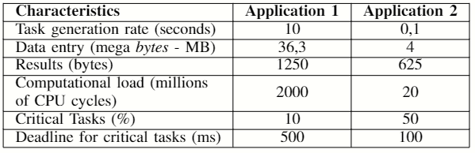
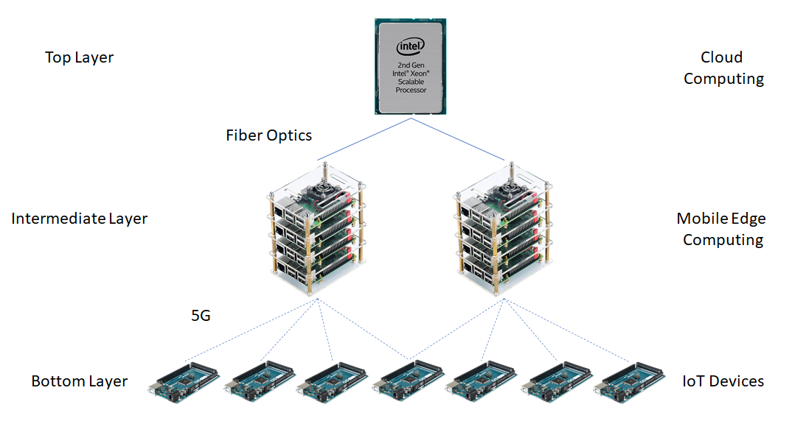
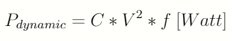
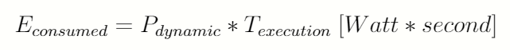

# Abstract
This is a simulator for a Mobile Edge Computing (MEC) environment with IoT devices and interaction with the Cloud. It simulates the scheduling of tasks in a three layer architecture with IoT devices, or user devices, in the bottom layer, MEC servers close to the final user in the intermediate layer and Data Centers from the Cloud in the top layer. An application is chosen and it's parameters are configured in the simulation. The number of IoT devices and MEC servers are also defined. Then the application is deployed in all IoT devices and they create tasks for this application. Each task is scheduled according to the energy and time costs associated with all avaliable processing option in the system. The Cloud is assumed to have infinite resources, as it has it's elasticity characteristic, and is only used when the local resources (cores from IoT devices and from MEC servers) are saturated.

# 1 Introduction

This project comprises of a simulator I developed for my **master's degree** at Federal University of Rio Grande do Sul (Portuguese: Universidade Federal do Rio Grande do Sul, UFRGS). It's main objective is to measure the total energy consumed and total elapsed time when processing tasks, from creation to conclusion, from a particular application. The built in scheduler calculates the costs associated to each resource allocation option in the architecture and selects the lowest one to execute the task. The same goes for all the application's tasks.

## 1.1 Processing sites
There are three available resource allocation options in the system:
* Local processing, in the Iot device: The scheduler can choose to keep the task in the IoT device and execute it locally, in it's own core.

* Local processing, in the MEC server: MEC servers are local servers that bring Cloud services close to the final user and it's main objective is to lower latency for the final user (Yu, 2016). Instead of offloading a task to the Cloud (higher latency) the task can the offloading to a smaller server (MEC server) that has processing capabilities much higher than the IoT device, but has lower latency than the Cloud. 

* Remote processing, in the Cloud's Data Centers: Data Centers are distant-centrilized processing clusters with high procesisng capabilities and virtual infinite resources. It's and available offloading option, but may add a lot of latency to the IoT application.

## 1.2 Types of tasks
The system has two different types of tasks, critical tasks and non-critical tasks. The critical tasks have deadline stablished on their creation, with means that they have to finish execution before reaching the deadline, otherwise the task will be automatically cancelled. The non-critical tasks don't have a deadline, so they won't be cancelled if processing takes too long.

## 1.3 Application and it's characteristics
When running the simulator we have to choose an application first. The application has a set of characteristics that must be configured in the simulator por it's propor execution. The characteristcs we have to set are:

* **Task generation rate**: Define how long will it take for tasks from the application to be created from one another.
* **Data size entry**: Define the size of the data the task needs for processing. This data size has impact in the data transmissions across the system adding energy and time costs for the task, depending on the allocation option.
* **Results size**: Define the size of the results a task delivers after finishing processing. For instance, if a task is allocated in a MEC server, it's results must be sent back to the origin, that is, the IoT device (user) that created the task.
* **Computacional load**: It's assumed that the user creates cyclical tasks and knows the number of CPU cycles a task have. The computacional load is used mainly to calculed the time needed for execution. 
* **Deadline**: Define the deadline for critical tasks. If a critical task is created, data transmissions (data entry and results) and processing must be lower than the deadline, otherwise the task will be cancelled.

Below there are two examples of applications. Application 1 is considered of high processing cost, while Application 2 is considered of low processing cost.

# 2 Architecture

The three layer architecture uses two different communication technologies. The IoT device layer communicates with the MEC layer with 5G and the MEC layer communicates with the Cloud layer with fiber optics.

The MEC servers are local servers placed close to the final user (IoT devices in this case) which provide lower latency when running tasks origined in those IoT devices, if compared to the Cloud latency. Even with more latency added to the application when tasks run in the MEC server or in the Cloud, it could be a better choice then running locally in the IoT's device core, because the executing time could be very high in the user's device. 

It is expected that the IoT devices move around the network, that's why a wireless connection is required between the bottom layer and the intermediate layer, so that offloading of data and task's source code can be performed.

## 2.1 Hardware description

The hardware that is describe below is used in the simulator, each element with it's corresponding characteristics.

* **IoT devices**: Each IoT device is assumed to be an Arduino Mega 2560. THe Arduino Mega 2500 has an ATmega2560 microcontroller with one 16MHz core. The available configurable frequencies for the microcontroller are 16 MHz, 8 MHz, 4MHz, 2 MHz and 1 MHz. The associated core voltages for each of the frequencies are, respectively, 5V, 4V, 2.7V, 2.3V and 1.8V. So, running a task with clock set to 2 MHz will make the voltage core be set to 2.3V.

* **MEC server**: MEC servers in the intermeadiate layer are composed of 5 Raspberry Pi4 Model B boards each. Raspberry Pi 4 ModelB is  equipped with a Quad-core Cortex-A72 1.5GHZ (ARMv8) 64-bit, summing a total of 20 CPUs per MEC server. Each CPU core has operating frequencies of 1500 MHz, 1000 MHz, 750 MHz and 600 MHz; the corresponding supply voltages are 1.2 V, 1V, 0.825 V and 0.8 V.

* **Data Center**: For the Cloud Computing layer were chosen Intel Xeon Cascade Lake processors of 2.8 GHz per CPU, reaching up to 3.9 GHz with Turbo Boost on. These processors can be found in some configurations on the Google Cloud.

* **Data connections**: It was established that both 5G and fiber optic communications could reach speeds of up to 1Gbps. For both, latency is set at 5ms. So the transfer time of a piece of data is the same in both cases. What differs is the energy consumption.

# 3 Calculation total task cost
The scheduling algorithm (presented in Chapter 4.) implements a cost model that evaluates the cost of processing a task locally in the IoT device, locally in the MEC server ou remotelly in the Cloud. The cost model and the equations used to calculate energy consume and elapsed time are shown in the following sections.

## 3.2 Time equation

## 3.1 Energy equations
When we have some load to be processed in a CPU core the power consumed is equal to:

 

For the dynamic power equation, *C* stands for capacitance, *V* for volts (CPU core tension) and *f* from frequency There are other components that could be used to make the total power more acurate, like leak power and short circuit power, aside form the load power (dynamic power). These two represent a little percentage of the total power, and are disregarded here (Burd; Brodersen, 1996).

Given the power consumed by a CPU core the total energy consumed can be calculated as:

## 3.3. DVFS
The DVFS (Dynamic Voltage and Frequency Scaling) technique is used in order to alter the energy consumed by the CPU cores of both IoT devices and MEC servers during execution time. The TEMS algorithm calculates the final costs of all options of operating frequency and core voltage and chooses the best fitting option, i. e. the pair frequency-voltage that provides the minimum calculated cost for the system.

# 4. The TEMS scheduling algorithm
So we have the three layer architecture, the layers interaction with it's corresponding type of communication technology (5G and fiber optics) 

# 5. Setting the project and running experiments
The simulator executes a scheduling algorithm in a Mobile Edge Computing (MEC) environment. The scheduling algorithm, named TEMS (Time and Energy Minimization Scheduler) is responsable for 

## 5.1 Macro allocation process
Here is a step-by-step of how the simulator works:

1. Choose the application characteristcs and configure then in the simulator. 

2. Choose the number of IoT devices, MEC servers and number of created tasks. Ex.: 100 IoT devices, 2 MEC servers and 500 tasks. In this configuration each IoT device will create 5 tasks. 

Tasks are created in the IoT devices. If the scheduling algorithm devices to offload the task and execute it in a MEC server, then a 5G connecting is made, adding latency to the application. But if the task if offloaded to the Cloud, then a 5G connecting is made with the MEC server, which receives the tasks data and source code, and another connecting between the MEC server and the Cloud is made, finally sending the tasks data and source code to the Cloud. In this second case more latency is added to the application. When the task's executing is complete the results must be sent back to the IoT device (the user).

# References:
* Yu, H.; Wang, Q.; Guo, S. Energy-efficient task offloading and resource scheduling for mobile edge computing. In: 2018 IEEE International Conference on Networking, Architecture and Storage (NAS). [S.l.: s.n.], 2018. p. 1–4. ISSN null.
* Burd, T.; Brodersen, R. Processor design for portable systems. Journal of VLSI Signal Processing, v. 13, 11 1996.

