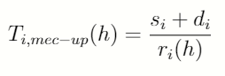

# Abstract
This is a simulator for a Mobile Edge Computing (MEC) environment with IoT devices and interaction with the Cloud. It simulates the scheduling of tasks in a three layer architecture with IoT devices, or user devices, in the bottom layer, MEC servers close to the final user in the intermediate layer and Data Centers from the Cloud in the top layer. An application is chosen and it's parameters are configured in the simulation. The number of IoT devices and MEC servers are also defined. Then the application is deployed in all IoT devices and they create tasks for this application. Each task is scheduled according to the energy and time costs associated with all avaliable processing option in the system. The Cloud is assumed to have infinite resources, as it has it's elasticity characteristic, and is only used when the local resources (cores from IoT devices and from MEC servers) are saturated.

# 1 Introduction

This project comprises of a simulator I developed for my **master's degree** at Federal University of Rio Grande do Sul (Portuguese: Universidade Federal do Rio Grande do Sul, UFRGS). It's main objective is to measure the total energy consumed and total elapsed time when processing tasks, from creation to conclusion, from a particular application. The built in scheduler calculates the costs associated to each resource allocation option in the architecture and selects the lowest one to execute the task. The same goes for all the application's tasks.

## 1.1 Processing sites
There are three available resource allocation options in the system:
* Local processing, in the Iot device: The scheduler can choose to keep the task in the IoT device and execute it locally, in it's own core.

* Local processing, in the MEC server: MEC servers are local servers that bring Cloud services close to the final user and it's main objective is to lower latency for the final user (Yu, 2016). Instead of offloading a task to the Cloud (higher latency) the task can the offloading to a smaller server (MEC server) that has processing capabilities much higher than the IoT device, but has lower latency than the Cloud. 

* Remote processing, in the Cloud's Data Centers: Data Centers are distant-centrilized processing clusters with high procesisng capabilities and virtual infinite resources. It's and available offloading option, but may add a lot of latency to the IoT application.

## 1.2 Types of tasks
The system has two different types of tasks, critical tasks and non-critical tasks. The critical tasks have deadline stablished on their creation, with means that they have to finish execution before reaching the deadline, otherwise the task will be automatically cancelled. The non-critical tasks don't have a deadline, so they won't be cancelled if processing takes too long.

## 1.3 Application and it's characteristics
When running the simulator we have to choose an application first. The application has a set of characteristics that must be configured in the simulator por it's propor execution. The characteristcs we have to set are:

* **Task generation rate**: Define how long will it take for tasks from the application to be created from one another.
* **Data size entry**: Define the size of the data the task needs for processing. This data size has impact in the data transmissions across the system adding energy and time costs for the task, depending on the allocation option.
* **Results size**: Define the size of the results a task delivers after finishing processing. For instance, if a task is allocated in a MEC server, it's results must be sent back to the origin, that is, the IoT device (user) that created the task.
* **Computacional load**: It's assumed that the user creates cyclical tasks and knows the number of CPU cycles a task have. The computacional load is used mainly to calculed the time needed for execution. 
* **Deadline**: Define the deadline for critical tasks. If a critical task is created, data transmissions (data entry and results) and processing must be lower than the deadline, otherwise the task will be cancelled.

Below there are two examples of applications. Application 1 is considered of high processing cost, while Application 2 is considered of low processing cost.

# 2 Architecture

The three layer architecture uses two different communication technologies. The IoT device layer communicates with the MEC layer with 5G and the MEC layer communicates with the Cloud layer with fiber optics.

The MEC servers are local servers placed close to the final user (IoT devices in this case) which provide lower latency when running tasks origined in those IoT devices, if compared to the Cloud latency. Even with more latency added to the application when tasks run in the MEC server or in the Cloud, it could be a better choice then running locally in the IoT's device core, because the executing time could be very high in the user's device. 

It is expected that the IoT devices move around the network, that's why a wireless connection is required between the bottom layer and the intermediate layer, so that offloading of data and task's source code can be performed.

## 2.1 Hardware description

The hardware that is describe below is used in the simulator, each element with it's corresponding characteristics.

* **IoT devices**: Each IoT device is assumed to be an Arduino Mega 2560. THe Arduino Mega 2500 has an ATmega2560 microcontroller with one 16MHz core. The available configurable frequencies for the microcontroller are 16 MHz, 8 MHz, 4MHz, 2 MHz and 1 MHz. The associated core voltages for each of the frequencies are, respectively, 5V, 4V, 2.7V, 2.3V and 1.8V. So, running a task with clock set to 2 MHz will make the voltage core be set to 2.3V.

* **MEC server**: MEC servers in the intermeadiate layer are composed of 5 Raspberry Pi4 Model B boards each. Raspberry Pi 4 ModelB is  equipped with a Quad-core Cortex-A72 1.5GHZ (ARMv8) 64-bit, summing a total of 20 CPUs per MEC server. Each CPU core has operating frequencies of 1500 MHz, 1000 MHz, 750 MHz and 600 MHz; the corresponding supply voltages are 1.2 V, 1V, 0.825 V and 0.8 V.

* **Data Center**: For the Cloud Computing layer were chosen Intel Xeon Cascade Lake processors of 2.8 GHz per CPU, reaching up to 3.9 GHz with Turbo Boost on. These processors can be found in some configurations on the Google Cloud.

* **Data connections**: It was established that both 5G and fiber optic communications could reach speeds of up to 1Gbps. For both, latency is set at 5ms. So the transfer time of a piece of data is the same in both cases. What differs is the energy consumption.

# 3 Calculation total task cost
The scheduling algorithm (presented in Chapter 4.) implements a cost model that evaluates the cost of processing a task locally in the IoT device, locally in the MEC server ou remotelly in the Cloud. The cost model and the equations used to calculate energy consume and elapsed time are shown in the following sections.

## 3.1 Time equations
To calculate the execution time in a CPU core, we have to know the total number of CPU cycles the task have (*CT*) and the core's operating frequency (*f*).

 (Tanenbaum; Austin, 2012)

Also, if we have data transmissions we need the following equations:

 (Yu; Wang; Guo, 2018)

 

The variable ri(h) is the transfer rate between two layers of the architecture. Note that for IoT to MEC and MEC to IoT transfers, we use the "up" equation to send the task's entry data and source code from the IoT device to the MEC server and then the "down" equation to send the results from the MEC server back to the IoT device. If the processing is made in the Cloud, then we have an additional transfer from MEC to Cloud (entry data and source source) and then from Cloud to MEC (results). That's why running tasks in the Cloud adds more latency.

## 3.2 Energy equations
When we have some load to be processed in a CPU core the power consumed is equal to:

 

For the dynamic power equation, *C* stands for capacitance, *V* for volts (CPU core tension) and *f* from frequency There are other components that could be used to make the total power more acurate, like leak power and short circuit power, aside form the load power (dynamic power). These two represent a little percentage of the total power, and are disregarded here (Burd; Brodersen, 1996).

Given the power consumed by a CPU core the total energy consumed can be calculated as:

## 3.3 DVFS
The DVFS (Dynamic Voltage and Frequency Scaling) technique is used in order to alter the energy consumed by the CPU cores of both IoT devices and MEC servers during execution time (Sarangi; Goel; Singh, 2018). The TEMS algorithm calculates the final costs of all options of operating frequency and core voltage and chooses the best fitting option, i. e. the pair frequency-voltage that provides the minimum calculated cost for the system.

Altering the frequency and voltage in the power equation presented in Section 3.2, we have different power levels. With a lower frequency the power and energy consumed will be smaller, but execution time may be too long. **That is a trade-off the scheduling algorithm deals with**.

To make things clearer, look at the image below and see how pair of frequency and voltage can alter the power of a CPU core.

 (INTEL, 2004)

## 3.4 Cost model equations by task and for the system
Using the equations shown before we can calculate the total elapsed time and total energy consumed by **one** task if allocated to the IoT device itself:

 

The same goes for the cost in the MEC server and in the Cloud. In the equation above UlocalE and UlocalT represent, respectively, the energy and time coefficients used to make either energy or time more costly for this allocation option. 

To find the minimum cost in the system for the task we compare the costs of all allocation options and choose the smallest one:

In this equation the allocation option that yields the lowest cost per task is chosen. This process is made for all taks in the system. The alpha, beta and gama variable are priority variables, that can be set to prioritize one allocation option or another. A high value in a priority variable makes the corresponding allocation option more costly, which means it has lesser changes of being chosen. To make one particular allocation option more appealing (low cost) a small priority variable may be chosen.

# 4 The TEMS scheduling algorithm
So we have the three layer architecture, the layers interaction with it's corresponding type of communication technology (5G and fiber optics) 

Initially the scheduler collects information about the CPU cores from IoT devices, MEC servers and Data Centers (frequency-voltage pairs for DVFS, chipset capacitance, the battery level of IoT devices and set of tasks). In step 2 first the critical tasks are allocated, because of the deadline constraint, and then the non-critical tasks. Both sets of tasks are allocated to the processing option that brings the lesser cost for the system. For the particular case of critical tasks, the selected processing option also needs processing time smaller than the deadline, so it may not have the minimum cost for the system, but the scheduler will choose the minimum cost that allows the task to be concluded before deadline.

In step 3 tasks are monitored for conclusion. If a task finishes then the hardware used is made available for other tasks. Finally in step 4, the scheduler monitors the system for new tasks and updates the level of batteries for each IoT devices. If an IoT device reaches a inferior security limit of level battery, then allocation cannot occur in the IoT device anymore, because the scheduler will preserve the device to keep running (alive) and creating new tasks (application and users experience is maintained).

# 5 Setting the project and running experiments
The file you have to first look at is *SimulatorExecution.java*. There is the simulation's core, where are defined the characteristics of the applocations to be simulated, the number of created tasks in each simulation and number of IoT devices and MEC servers in the architecture.

Also, you have to define the energy and time coefficents used in the task's cost equation for each policy (coefficientEnergy and coefficientTime variables) and alpha, beta and gamma, used in the cost minimation equation of each task. The code is already set with a basic configuration, your just have to worry if you want to alter values, otherwise the simulation is ready to execute.

About some of the classes:

* **RAN_5G.java**: You can set the latency of the connection and transfer rate. It is also possible to alter the power consumed during data transmisison. A basic setup is alredy configured.

* **FiberOptics.java**: You can set the latency, power and transfer rate. A basic setup is alredy configured.

* **IoTDevice.java**: In the constructor method you can set the capacitance of the IoT device chipset, the power consumed in idle, battery level, battery inferior safety limit, and the pairs with frequency and voltage for the CPU cores. These pairs, alongside with the capacitance, are used to calculate the dynamic power of the CPU cores. A basic setup is alredy configured.

* **MECServer.java**: In the constructor method you can set the capacitance of the MEC server chipset, the power consumed in idle and the pairs with frequency and voltage for the CPU cores. These pairs, alongside with the capacitance, are used to calculate the dynamic power of the CPU cores. A basic setup is alredy configured.

* **CloudDataCenter.java**: In the constructor method you can set the standard and turbo boost frequencies of the Cloud CPU cores. In methods *calculateDynamicEnergyStandardFreq()* and *calculateDynamicEnergyTurboFreq()* you can set the CPU core power associated to each frequency.

* **Application.java, Scheduler.java and Task.java**: These classes have nothing to set. The characteristics associated to the application are set in *SimulatorExecution.java*.

The project is ready to be executed. Just alter the specified values to get different results.

# 6 Output files and data analysis
The simulation has been designed to output files in a format that makes analysis easy. The files generated are .txt files with values separed by commas. The file *01-500-100-1-200000-LoadVariation.txt* is an exmaple of output file.

To read this file you can use Microsoft Excel's import data from file feature. Just go the the **Data tab**, select option **Import data from text file** and choose the semicolon delimiter (';'). With that you can select data, plot graphs and analyse the simulation results. An example of spreadsheet is in *misc/dataImportedToExcel.xlsx*.

# 7 More info
If you want more detailed information about the cost model, simulator, experiments and results, please check the article inside the **misc** folder of this project (article-workinprogress.pdf).

## 7.1 Dependencies
This project uses javatuples-1.2.jar. This library is included in the "libraries" folder.

# References:
* Yu, H.; Wang, Q.; Guo, S. Energy-efficient task offloading and resource scheduling for mobile edge computing. In: 2018 IEEE International Conference on Networking, Architecture and Storage (NAS). [S.l.: s.n.], 2018. p. 1–4.
* Tanenbaum, A. S.; Austin, T. Structured Computer Organization. 6th. ed. Prentice Hall, 2012. ISBN 0132916525,9780132916523. Available from Internet: <http://gen.lib.rus.ec/book/index.php?md5=f6fc02a547e862360e743754fc06375b>.
* Burd, T.; Brodersen, R. Processor design for portable systems. Journal of VLSI Signal Processing, v. 13, 11 1996.
* INTEL. Enhanced Intel SpeedStep Technology for the Intel Pentium M Processor (White Paper). [S.l.], 2004. Available from Internet: <https://web.archive.org/web/20150812030010/http://download.intel.com/design/network/papers/30117401.pdf>.
* Sarangi, S. R.; Goel, S.; Singh, B. Energy efficient scheduling in iot networks. In: Proceedings of the 33rd Annual ACMSymposium on Applied Computing. New York, NY, USA: Association for Computing Machinery, 2018. (SAC ’18), p. 733–740. ISBN 9781450351911. Available from Internet: <https://doi.org/10.1145/3167132.3167213>.
